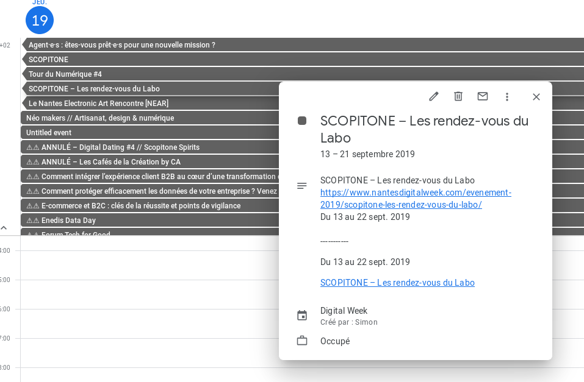

# Digital Week 2 ICS 2019

Un script simple fait en 30min (et mit sur git en 10min) pour transformer le planning de la nantes digital week 2019 en ICS (pour le mettre sur Google Calendar).
Utilise le JS de la carte du site web (plus simple que de faire un crawler) en l'évaluant.

Node.js

Pour essayer, cloner ce repo et faire `npm i`

